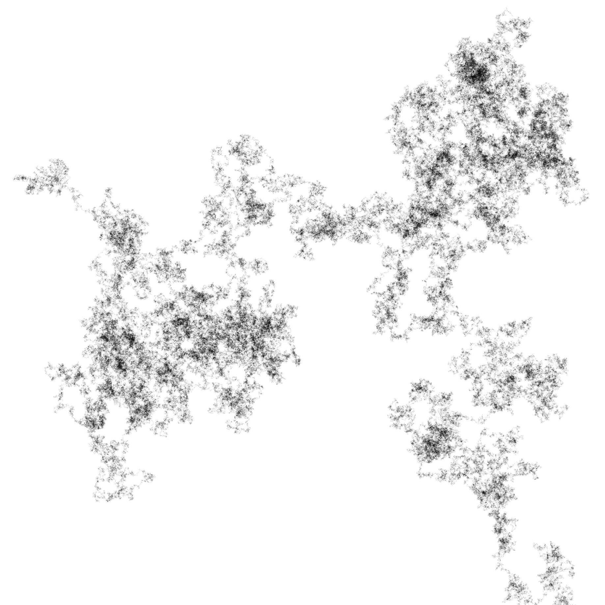

# Random Walk Image Generator

This program simulates random walk in tow dimensions and makes a image out of it.
For example:



## Requirements

* numpy
* scipy
* PIL
* tqdm


## Usage

```
$ python random_walker.py
```
will make a image file called 'random_walk.jpg'.


## Parameters

| Parameter           | Default           | Description                     |
|---------------------|-------------------|---------------------------------|
| output_file (-o)    | 'random_walk.jpg' | output file path                |
| canvas_width (-cw)  | 2048              | width of the canvas in pixel    |
| canvas_height (-ch) | 2048              | height of the canvas in pixel   |
| n_steps (-s)        | 2000000           | number of steps to walk         |
| ink_shade (-i)      | 0.13              | the higher, the darker ink gets |


## Details

The starting point is in the middle of the canvas. In each step, the probability of going to
each pixel around current position and staying is the same. The pixel gets darker every time being visited.

*Happy Walking!*